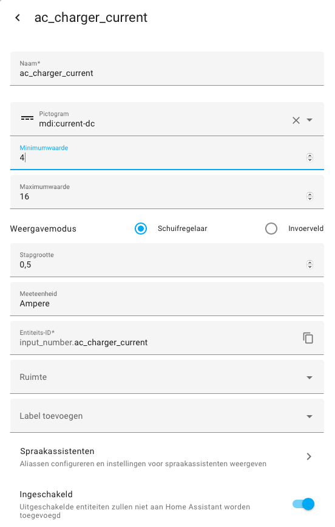
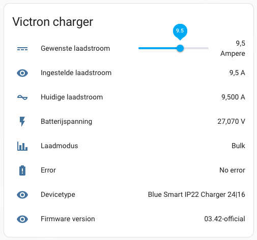

# Victron charger control

The Victron Energy Blue Smart IP22 chargers have an (unsupported) hidden serial port, supporting (parts of) the VE.direct protocol.

You need:
- An ESP32 running the ESPHome config from for example [victron-charger-control.yaml](victron-charger-control.yaml)
- A few jumper cables to connect GND, RX and TX to the charger and the ESP (remember, connect RX on the charger with TX on the ESP, and TX on the charger with RX on the ESP)

## Settings in Home Assistant:
In Home Assistant you need a 'input number'-helper to control the current. Call this helper `input_number.ac_charger_current` (which is the same name as the entity_id given in the esphome config (on line 196))
This looks something like this:

Adapt the ESPHome example yaml to your needs, and load this onto a ESP32 (I use a D1 mini ESP32) 

You can get the following information on you Home Assistant dashboard (among others). With the slider you can control the charge current.

## Resources:
- Connecting to the serial port: https://github.com/pvtex/Victron_BlueSmart_IP22
- Reading the serial port with ESPHome: https://github.com/KinDR007/VictronMPPT-ESPHOME
- Writing the current to the charger, information on the Victron community page: https://community.victronenergy.com/questions/226131/bluesmart-ip22-charger-and-vedirect.html